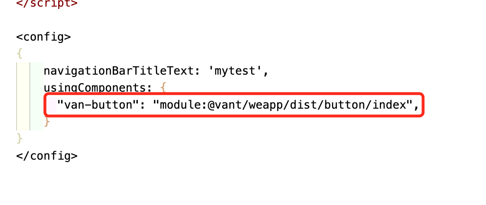

### [wepy](https://github.com/Tencent/wepy)集成[vant](https://vant-contrib.gitee.io/vant-weapp/#/intro) 项目示例

1.安装依赖
```
  npm install
  or
  yarn install
```

2.运行项目
```
  npm run dev
  or
  yarn dev
```

3.用微信开发者工具打开根目录

4.配置开发者工具'本地设置'选项

 

5.wpy文件中增加组件引用

 

6.wpy文件模板中正常使用
```
<div class="container">
  <van-button bindtap="mytestClick" type="primary">按钮<van-button>
</div>  
```